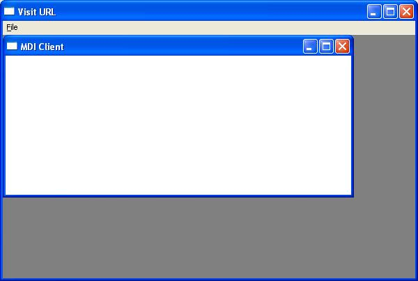

## API MDIForm

### Description

Build MDI form via Windows API.

This code is very usefull to

sublsclass and handle

MDI Main form and child.

You can use thes code as you like without any limitations.

Please vote me.
 
### More Info
 
Public Function WinMDIMain() As Long

Dim wndcls As WNDCLASSEX

Dim message As Msg

wndcls.cbSize = Len(wndcls)

wndcls.style = CS_HREDRAW + CS_VREDRAW

wndcls.lpfnWndProc = GetFuncPtr(AddressOf MDIClientHandler)

wndcls.cbClsExtra = 0

wndcls.cbWndExtra = 0

wndcls.hInstance = App.hInstance

wndcls.hIcon = 0

wndcls.hCursor = LoadCursor(0, IDC_ARROW)

wndcls.hbrBackground = COLOR_WINDOW

wndcls.lpszMenuName = 0

wndcls.lpszClassName = APP_NAME

If RegisterClassEx(wndcls) = 0 Then

MsgBox "Can't Register Class"

Exit Function

End If

wndcls.style = 0

wndcls.lpfnWndProc = GetFuncPtr(AddressOf MDIChildHandler)

wndcls.cbClsExtra = 0

wndcls.cbWndExtra = 0

wndcls.hInstance = App.hInstance

wndcls.hIcon = 0

wndcls.hCursor = LoadCursor(0, IDC_ARROW)

wndcls.hbrBackground = COLOR_WINDOW

wndcls.lpszMenuName = 0

wndcls.lpszClassName = CHILD_NAME

If RegisterClassEx(wndcls) = 0 Then

MsgBox "Can't Register Class"

Exit Function

End If

'Main form

hWnd = CreateWindowEx(0&, APP_NAME, _

App.ProductName, WS_OVERLAPPEDWINDOW, _

CW_USEDEFAULT, 0, _

CW_USEDEFAULT, 0, 0&, 0&, _

App.hInstance, 0&)

While (GetMessage(message, hWnd, 0, 0)) And message.message &lt;&gt; WM_NULL

TranslateMessage message

DispatchMessage message

DoEvents

Wend

WinMDIMain = message.wParam

End Function

             |
---                |---
**Submitted On**   |2006-03-07 12:17:22
**By**             |[experttano](https://github.com/Planet-Source-Code/PSCIndex/blob/master/ByAuthor/experttano.md)
**Level**          |Advanced
**User Rating**    |4.0 (32 globes from 8 users)
**Compatibility**  |VB 4\.0 \(16\-bit\), VB 4\.0 \(32\-bit\), VB 5\.0, VB 6\.0
**Category**       |[Windows API Call/ Explanation](https://github.com/Planet-Source-Code/PSCIndex/blob/master/ByCategory/windows-api-call-explanation__1-39.md)
**World**          |[Visual Basic](https://github.com/Planet-Source-Code/PSCIndex/blob/master/ByWorld/visual-basic.md)
**Archive File**   |[API\_MDIFor205225372007\.zip](https://github.com/Planet-Source-Code/experttano-api-mdiform__1-68071/archive/master.zip)

### API Declarations

so many:)

